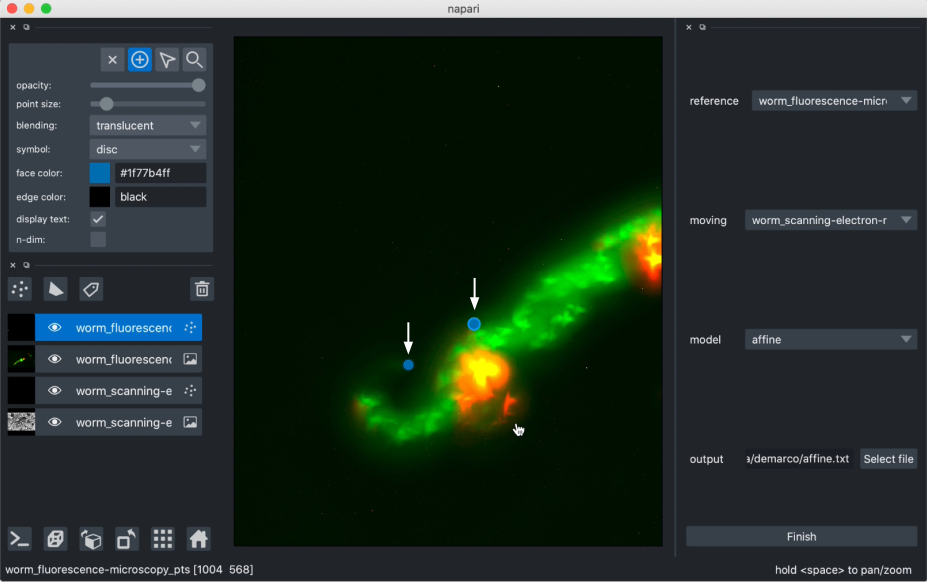

# Description

This GUI plugin allows you to quickly find the affine matrix mapping
one image to another using manual correspondence points annotation.

More simply, this plugin allows you to select corresponding points
on an image, and a second image you wish to transform. It computes 
the requisite transformation matrix using Affine Transform, Euclidean Transform, 
or Similarity Transform, and performs this transformation on the
moving image, aligning it to the reference image.

# Who is This For?

This is a simple plugin which can be used on any 2D images, provided
they can be loaded as layers into napari. The images need not be the same
file format and this plugin also works with labels layers.

No prior understanding of the transformation methods is required, as
they perform in the background based on the reference points selected.

# How to Guide

You will need a combination of two or more 2D image and/or labels layers 
loaded into napari. Once you have installed affinder, you can find it in
the dock widgets menu.

The first two dropdown boxes will be populated with the layers currently
loaded into napari. Select a layer to use as reference, and another to
transform.

Next, you can select the transformation model to use (affine is selected by default
and is the least rigid transformation of those available). See [below](#models) for a
description of the different models.

Finally, you can optionally select a path to a text file for saving out the
resulting transformation matrix.

When you click Start, affinder will add two points layers to napari. 
The plugin will also bring your reference image in focus, and its associated points
layer. You can then start adding reference points by clicking on your image.

Once three points are added, affinder will switch focus to the moving image,
and you should then proceed to select the corresponding three points.

## Transformation Models

# Getting Help

If you find a bug with affinder, or would like support with using it, please raise an
issue on the GitHub repository `https://github.com/jni/affinder`.

# How to Cite

Many plugins may be used in the course of published (or publishable) research, as well as
during conference talks and other public facing events. If you'd like to be cited in
a particular format, or have a DOI you'd like used, you should provide that information here.